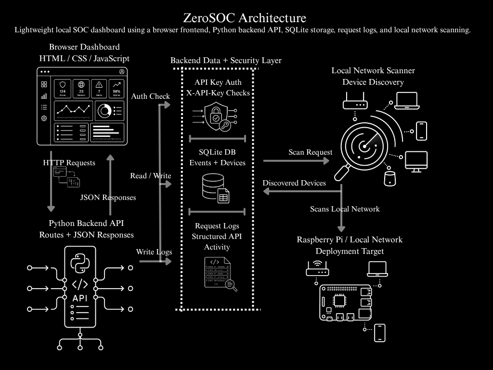
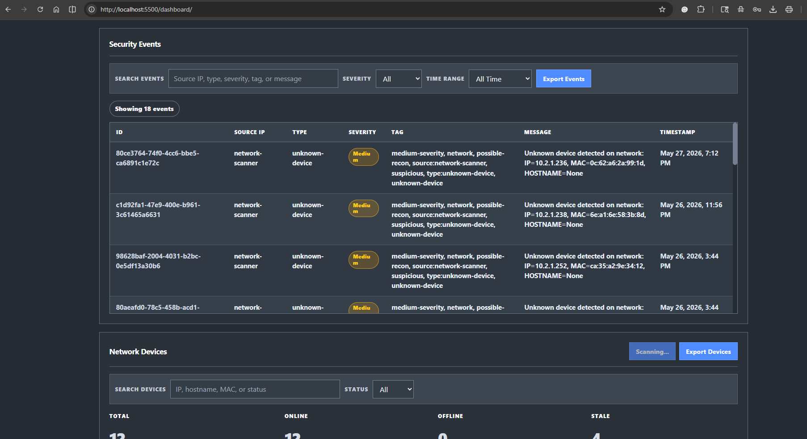
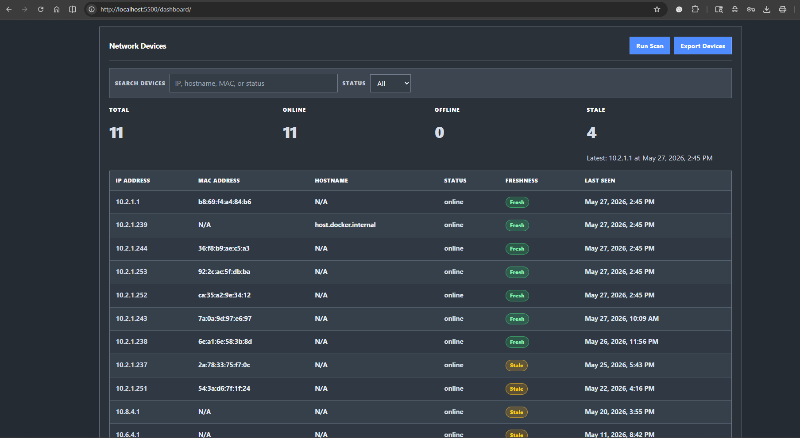

# ZeroSOC


ZeroSOC is a lightweight cybersecurity monitoring dashboard built with Python, SQLite, and a simple web frontend. It is designed as a small home-lab SOC-style project that monitors local system health, tracks API activity, stores security events, scans local network devices, groups alerts into incidents, tracks investigation reports, and displays operational data in a browser dashboard.

The project is intended to run on lightweight hardware such as a Raspberry Pi Zero 2 W, while also being easy to develop and test on a Windows machine.

## Project Status

ZeroSOC is currently in Phase 9: Deployment Testing and Documentation Cleanup.

Phase 9 focuses on validating the backend API, confirming dashboard functionality, testing deployment behavior, documenting verified endpoints, and cleaning the README so the project is easier to understand from GitHub.

Current Phase 9 progress:

- Backend API endpoints tested
- API key protection tested
- Dashboard refresh behavior tested
- Security events endpoint tested
- Event summary endpoint tested
- Device inventory endpoint tested
- Backend metrics endpoint tested
- README updated with Phase 9 notes
- Deployment testing screenshots captured
- Documentation cleanup in progress

---

## Deployment Testing

Phase 9 deployment testing verifies that ZeroSOC can run locally, expose its backend API, protect selected routes with an API key, and display live backend data in the dashboard.

The following areas were tested:

- Backend health check
- Status endpoint
- [x] Backend server starts successfully
- [x] `/api/v1/health` returns successfully
- [x] `/api/v1/status` returns successfully
- [x] `/api/v1/system` returns successfully with valid API key
- [x] `/api/v1/events` returns successfully with valid API key
- [x] `/api/v1/events/summary` returns successfully with valid API key
- [x] `/api/v1/devices` returns successfully with valid API key
- [x] `/api/v1/metrics` returns successfully with valid API key
- [x] Missing API key test rejects protected request
- [x] Bad API key test rejects protected request
- [x] Dashboard loads against the running backend
- [x] Dashboard refresh button updates dashboard data successfully
- [x] Security Events counter displays the current event count
- [x] Security Events table uses a scrollable layout for long event lists

### Phase 9 Status

Local deployment testing is complete.

Raspberry Pi hardware deployment remains planned under Phase 8.

### Phase 9 Test Screenshots

| Test | Screenshot |
| --- | --- |
| Health endpoint | `screenshots/api-health.png` |
| Status endpoint | `screenshots/api-status.png` |
| System endpoint with valid API key | `screenshots/api-system.png` |
| Events endpoint with valid API key | `screenshots/api-events.png` |
| Events summary endpoint with valid API key | `screenshots/api-events-summary.png` |
| Devices endpoint with valid API key | `screenshots/api-devices.png` |
| Metrics endpoint with valid API key | `screenshots/api-metrics.png` |
| Missing API key rejection | `screenshots/api-missing-key.png` |
| Bad API key rejection | `screenshots/api-bad-key.png` |
| Dashboard refresh test | `screenshots/dashboard-refresh-proof.png` |
| Dashboard Security Events section | `screenshots/dashboard-events.png` |
| Dashboard Network Devices section | `screenshots/dashboard-devices.png` |

## Phase 9 Deployment Testing Screenshots

| Screenshot File | Purpose | Status |
| --- | --- | --- |
| `screenshots/api-health.png` | Shows successful health endpoint test | Complete |
| `screenshots/api-status.png` | Shows successful status endpoint test | Complete |
| `screenshots/api-system.png` | Shows protected system endpoint test with valid API key | Complete |
| `screenshots/api-events.png` | Shows protected events endpoint test with valid API key | Complete |
| `screenshots/api-events-summary.png` | Shows event summary endpoint test | Complete |
| `screenshots/api-devices.png` | Shows devices endpoint test | Complete |
| `screenshots/api-metrics.png` | Shows metrics endpoint test | Complete |
| `screenshots/api-missing-key.png` | Shows protected endpoint rejection without API key | Complete |
| `screenshots/api-bad-key.png` | Shows protected endpoint rejection with invalid API key | Complete |
| `screenshots/dashboard-refresh-proof.png` | Shows dashboard refresh workflow | Complete |
| `screenshots/dashboard-events.png` | Shows searchable, filterable, scrollable security event table with event count | Complete |
| `screenshots/dashboard-devices.png` | Shows searchable and filterable network device inventory | Complete |

### Confirmed Phase 9 Test Results

| Area | Status |
| --- | --- |
| Backend server startup | Passing |
| Public API endpoints | Passing |
| Protected API endpoints | Passing |
| Missing API key rejection | Passing |
| Bad API key rejection | Passing |
| JSON response formatting | Passing |
| Request ID tracking | Passing |
| Dashboard/API connection | Passing |
| Dashboard refresh workflow | Passing |
| Security Events counter | Passing |
| Security Events scrollable table | Passing |
| Raspberry Pi deployment validation | Pending |

## Project Overview

ZeroSOC is being built as a cybersecurity and backend development portfolio project.

The goal is to demonstrate practical backend engineering, API design, local persistence, request logging, basic security controls, network visibility, alert workflows, incident tracking, investigation reporting, and dashboard presentation in one compact project.

ZeroSOC currently includes:

- Python backend server
- Versioned API routes
- Protected API endpoints
- API key authentication
- SQLite database storage
- Structured request logging
- Request ID tracking
- Security event collection
- Event auto-tagging
- Event severity classification
- Event summary reporting
- Time-window filtering for security event review
- Local network device scanning
- Unknown device detection
- Automatic alert creation from notable events
- Alert status workflow
- Alert SLA tracking with overdue and due-soon states
- Priority and SLA filtering for alert queues
- Incident grouping
- Incident activity tracking
- Investigation report tracking
- Alert notification tracking
- CSV export support for alerts, incidents, security events, network devices, and investigation activity
- JSON export support for investigation report handoff bundles
- Web dashboard using HTML, CSS, JavaScript, and Chart.js

## Portfolio Summary

ZeroSOC is a lightweight local security operations dashboard built to demonstrate backend API design, cybersecurity monitoring concepts, local persistence, and dashboard integration.

The project uses a browser-based frontend connected to a Python backend API. The backend exposes protected API endpoints, collects system and network data, stores security events and discovered devices in SQLite, writes structured request logs, and returns JSON responses to the dashboard.

ZeroSOC is designed for home-lab and Raspberry Pi deployment, making it small enough to run on lightweight hardware while still demonstrating practical backend and security engineering concepts.

## Technical Highlights

- Python backend API using HTTP route handling
- API key authentication with protected endpoints
- SQLite database storage for security events and network devices
- Structured request logging for API activity
- Local network scanner for device discovery
- Security event tracking with severity, event type, and tagging
- Event summary reporting for dashboard analytics
- Browser-based dashboard using HTML, CSS, and JavaScript
- Designed for Raspberry Pi and local home-lab deployment

## Skills Demonstrated

| Area | Demonstrated Through |
| --- | --- |
| Backend API Design | Versioned API routes, JSON responses, protected endpoints |
| Cybersecurity Concepts | Security events, alert-style tracking, unknown device detection |
| Authentication | API key checks using the `X-API-Key` header |
| Data Persistence | SQLite storage for events and network device records |
| Logging | Structured request logs for API activity |
| Network Visibility | Local device discovery using scanner logic |
| Frontend Integration | Dashboard panels that consume backend API data |
| Deployment Awareness | Lightweight architecture intended for Raspberry Pi deployment |
| Documentation | README structure, screenshots, architecture diagram, endpoint references |

## Project Scope

ZeroSOC is a portfolio-focused local SOC-style dashboard. It is not intended to replace enterprise SIEM, EDR, or commercial monitoring platforms. Instead, it demonstrates how core backend, logging, persistence, authentication, and security-monitoring concepts can be combined into a small, understandable system.

---

## What This Demonstrates

ZeroSOC demonstrates practical cybersecurity and backend development skills through a working local SOC-style monitoring dashboard.

Key demonstrated skills include:

- Backend API design using Python
- API key authentication for protected routes
- SQLite database storage for security events and network devices
- Request logging and request ID tracking
- Security event classification and auto-tagging
- Alert workflow design with SLA and priority tracking
- Incident grouping and investigation report workflows
- Local network scanning and unknown-device detection
- Frontend dashboard development using HTML, CSS, JavaScript, and Chart.js
- GitHub documentation with screenshots, endpoint references, and test checklists

## Dashboard Preview

ZeroSOC includes a browser-based dashboard that displays backend API data in a clean light-gray SOC-style interface with readable cards, accessible focus states, visible action buttons, responsive filter toolbars, and dashboard summary sections.

The dashboard includes:

- API status indicator
- Refresh control
- Summary cards
- System status panel
- Metrics panel
- Event summary section
- Security event analytics charts
- Searchable and filterable security events table
- Exportable security event CSVs
- Active alerts section
- Alert priority and SLA filters
- Incident groups
- Incident activity tracking
- Alert notifications panel
- Investigation reports panel
- Report activity tracking
- Resolved alerts section
- Searchable and filterable network devices table
- Device freshness summaries
- Dashboard-triggered network scans

## Architecture

ZeroSOC uses a lightweight local architecture designed for Raspberry Pi deployment and home-lab cybersecurity monitoring.

The system is built around a browser-based dashboard that communicates with a Python backend API over HTTP. The backend handles API key authentication, protected API routes, SQLite storage, request logging, local system metrics, network scanning, and SOC-style event processing.



### Architecture Overview

| Component | Purpose |
| --- | --- |
| Web Dashboard | Browser-based frontend built with HTML, CSS, JavaScript, and Chart.js |
| Python Backend API | Handles HTTP routes, protected endpoints, request processing, and API key authentication |
| SQLite Database | Stores security events and discovered network devices |
| Request Logs | Tracks API requests and supports CSV/JSON export workflows |
| System Metrics | Collects local CPU, RAM, disk, uptime, and system health information |
| Network Scanner | Reads local network, ARP, and device data |
| SOC Logic | Handles auto-tagging, alert creation, and unknown device detection |
| Deployment Target | Designed to run on Raspberry Pi hardware inside a local network |

---

## Screenshots

### Dashboard Overview


The dashboard overview shows the ZeroSOC header, local SOC overview label, API status indicator, refresh control, summary cards, system status panel, and backend metrics.

### Event Summary and Security Event Analytics


The event summary and analytics section shows total security events, severity counts, event type breakdowns, tag summaries, and charts for events by severity and event type.

### Alerts, Incidents, and Notifications


The alerts workflow section shows active alert filters, priority filters, SLA filters, alert search, CSV export controls, incident groups, incident activity, and alert notifications.

### Investigation Reports and Resolved Alerts


The investigation and resolution section shows investigation report filters, report activity tracking, export controls, resolved alert history, SLA resolution details, and reopen actions.

### Security Events



The security events section shows searchable and filterable event records, severity filtering, time-range filtering, event export controls, a live event count, and a scrollable event table for longer event lists.

### Network Devices



The network devices section shows discovered devices, device status filtering, device search, freshness indicators, network scan controls, and device CSV export support.

### API Health Response


The health endpoint confirms that the ZeroSOC backend is running and returning structured API responses.

---

## Tech Stack

| Area | Technology |
| --- | --- |
| Backend | Python |
| Server | `http.server` / `BaseHTTPRequestHandler` |
| Database | SQLite |
| Frontend | HTML, CSS, JavaScript |
| Charts | Chart.js |
| Logging | JSON-style request logs |
| Security | API key authentication |
| Platform Target | Raspberry Pi Zero 2 W / Windows development machine |
| Version Control | Git and GitHub |

---

## Core Features

### System Health Monitoring

ZeroSOC exposes system status data through API endpoints. This includes service status, host information, uptime, platform details, Python version, disk usage, and current backend runtime information.

### API Key Authentication

Protected endpoints require an API key using the `X-API-Key` header.

Example:

```powershell
Invoke-RestMethod "http://localhost:8000/api/v1/system" -Headers @{"X-API-Key"="dev-zero-soc-key"}
```

### Request Logging

ZeroSOC records API request activity using structured logs. Request logs include request ID, method, endpoint, client IP, status code, latency, timestamp, and message.

### Security Event Collection

Security events can be created, stored, filtered, summarized, exported, and reviewed through the API and dashboard.

Security event data includes:

- Event ID
- Timestamp
- Source IP
- Event type
- Severity
- Message
- Tags

### Event Auto-Tagging

ZeroSOC automatically assigns tags to events based on severity, event type, source, and message content.

Example tags include:

- `high-priority`
- `needs-review`
- `failed-login`
- `authentication`
- `network`
- `possible-recon`
- `unknown-device`
- `malware-related`
- `system`
- `storage`

### Alert Workflow

High-priority and review-worthy events are surfaced as alerts. Alerts can be filtered, acknowledged, resolved, reopened, exported, and grouped into incidents.

Alert workflow features include:

- Active alerts
- Resolved alerts
- Alert status updates
- Acknowledgement notes
- Priority scoring
- SLA tracking
- Overdue and due-soon states
- Alert CSV export

### Incident Grouping

Alerts are grouped into incident-style views by source and event type. Incident groups can be assigned an owner, given notes, updated by status, and exported.

Incident features include:

- Incident grouping
- Incident owner tracking
- Incident status tracking
- Incident notes
- Incident activity history
- Incident activity export
- Incident CSV export

### Investigation Reports

ZeroSOC supports lightweight investigation reports tied to alerts.

Report features include:

- Create report from alert
- Edit report title and summary
- Mark report as draft or final
- Print report view
- Export report handoff JSON
- Archive and restore reports
- Report activity tracking
- Report activity CSV export

### Alert Notifications

ZeroSOC tracks alert notifications locally and supports optional webhook delivery.

Notification features include:

- Local notification log
- Optional webhook delivery
- Notification cooldown
- Delivered, failed, and skipped notification states
- Notification history in the dashboard

### Network Device Monitoring

ZeroSOC can scan the local network, identify active devices, store discovered devices, and create security events for unknown devices.

Device data includes:

- IP address
- Hostname
- MAC address
- Status
- First seen timestamp
- Last seen timestamp
- Stale device status

### Dashboard UI

The dashboard displays backend data through a browser-based interface using HTML, CSS, JavaScript, and Chart.js.

Dashboard features include:

- System status
- API metrics
- Event summaries
- Security event analytics charts
- Active alert queue
- Incident groups
- Incident activity
- Alert notifications
- Investigation reports
- Report activity
- Resolved alerts
- Searchable security events
- Searchable network devices
- CSV export controls
- Dashboard-triggered network scans

---

## API Endpoints

ZeroSOC exposes public service-check endpoints and protected SOC data endpoints.

Protected endpoints require:

```text
X-API-Key: dev-zero-soc-key
```

### Public Endpoints

| Method | Endpoint | Description |
| --- | --- | --- |
| GET | `/api/v1/health` | Basic backend health check |
| GET | `/api/v1/status` | Lightweight service status |

### Protected Core Endpoints

| Method | Endpoint | Description |
| --- | --- | --- |
| GET | `/api/v1/system` | Host system health and machine details |
| GET | `/api/v1/metrics` | Request, event, and device metrics |
| GET | `/api/v1/logs/recent` | Recent API request logs |

### Security Event Endpoints

| Method | Endpoint | Description |
| --- | --- | --- |
| GET | `/api/v1/events` | List recent security events with optional filters |
| GET | `/api/v1/events/export` | Export security events as CSV |
| GET | `/api/v1/events/summary` | Security event summary and counts |
| GET | `/api/v1/events/{id}` | Retrieve a single security event by ID |
| POST | `/api/v1/events` | Create a manual security event |

### Alert Endpoints

| Method | Endpoint | Description |
| --- | --- | --- |
| GET | `/api/v1/alerts` | List active, acknowledged, or resolved alerts |
| GET | `/api/v1/alerts/export` | Export alerts as CSV |
| POST | `/api/v1/alerts/{id}/status` | Update alert status or acknowledgement note |

### Incident Endpoints

| Method | Endpoint | Description |
| --- | --- | --- |
| GET | `/api/v1/alerts/incidents/export` | Export grouped alert incidents as CSV |
| GET | `/api/v1/alerts/incidents/activity` | List incident activity history |
| GET | `/api/v1/alerts/incidents/activity/export` | Export incident activity as CSV |
| POST | `/api/v1/alerts/incidents/{incident_id}/state` | Update incident owner, note, or status |

### Investigation Report Endpoints

| Method | Endpoint | Description |
| --- | --- | --- |
| GET | `/api/v1/alerts/reports` | List investigation reports |
| GET | `/api/v1/alerts/reports/activity` | List investigation report activity |
| GET | `/api/v1/alerts/reports/activity/export` | Export report activity as CSV |
| GET | `/api/v1/alerts/reports/{id}/print` | Open printable investigation report view |
| GET | `/api/v1/alerts/reports/{id}/export` | Export investigation report handoff JSON |
| POST | `/api/v1/alerts/{id}/report` | Create an investigation report for an alert |
| POST | `/api/v1/alerts/reports/{id}/status` | Update report status |
| POST | `/api/v1/alerts/reports/{id}/details` | Update report title or summary |
| POST | `/api/v1/alerts/reports/{id}/archive` | Archive an investigation report |
| POST | `/api/v1/alerts/reports/{id}/restore` | Restore an archived investigation report |

### Notification Endpoints

| Method | Endpoint | Description |
| --- | --- | --- |
| GET | `/api/v1/alerts/notifications` | List alert notification history |
| POST | `/api/v1/alerts/notifications` | Log or send notifications for unresolved alerts |

### Network Device Endpoints

| Method | Endpoint | Description |
| --- | --- | --- |
| GET | `/api/v1/devices` | List known network devices |
| GET | `/api/v1/devices/export` | Export network devices as CSV |
| GET | `/api/v1/network/scan` | Run local network scan and detect unknown devices |

---

## Query Filters

### Security Event Query Filters

`GET /api/v1/events` supports optional filters:

| Query Parameter | Description |
| --- | --- |
| `limit` | Maximum number of events to return |
| `severity` | Filter by severity: `critical`, `high`, `medium`, `low` |
| `tag` | Filter by event tag |
| `event_type` | Filter by event type |
| `source` | Filter by source IP |
| `q` | Search source, type, message, or tags |
| `since_hours` | Return events from the last N hours |

Examples:

```text
/api/v1/events?severity=high
/api/v1/events?since_hours=24
/api/v1/events?q=login
```

### Alerts

`GET /api/v1/alerts` supports optional filters:

| Query Parameter | Description |
| --- | --- |
| `limit` | Maximum number of alerts to return |
| `status` | Filter by `active`, `open`, `acknowledged`, `resolved`, or `all` |
| `severity` | Filter by severity |
| `priority` | Filter by `urgent`, `high`, `medium`, or `low` |
| `sla_status` | Filter by `on-track`, `due-soon`, `overdue`, `resolved`, or `unknown` |
| `q` | Search source, message, or event type |

Examples:

```text
/api/v1/alerts?status=active
/api/v1/alerts?priority=urgent
/api/v1/alerts?sla_status=overdue
```

### Network Device Query Filters

`GET /api/v1/devices` supports optional filters:

| Query Parameter | Description |
| --- | --- |
| `limit` | Maximum number of devices to return |
| `status` | Filter by device status |
| `q` | Search IP, hostname, MAC address, or status |

Examples:

```text
/api/v1/devices?status=online
/api/v1/devices?q=192
```

---

## Running Locally

### 1. Clone the repository

```bash
git clone https://github.com/britufkin1225-web/zerosoc.git
cd zerosoc
```

### 2. Run the backend

```bash
python run.py
```

Backend URL:

```text
http://localhost:8000
```

### 3. Run the dashboard locally

From the project root:

```bash
python -m http.server 5500
```

Dashboard URL:

```text
http://localhost:5500/dashboard/
```

---

## Local Testing Checklist

### Public Browser Tests

These can be opened directly in the browser:

```text
http://localhost:8000/api/v1/health
http://localhost:8000/api/v1/status
```

Expected:

- `success: true`
- `status_code: 200`
- JSON response body

### Protected API Tests

Protected routes require the API key header. Use PowerShell:

```powershell
$headers = @{ "X-API-Key" = "dev-zero-soc-key" }

Invoke-RestMethod -Uri "http://localhost:8000/api/v1/system" -Headers $headers
Invoke-RestMethod -Uri "http://localhost:8000/api/v1/metrics" -Headers $headers
Invoke-RestMethod -Uri "http://localhost:8000/api/v1/logs/recent" -Headers $headers
Invoke-RestMethod -Uri "http://localhost:8000/api/v1/events" -Headers $headers
Invoke-RestMethod -Uri "http://localhost:8000/api/v1/events/summary" -Headers $headers
Invoke-RestMethod -Uri "http://localhost:8000/api/v1/alerts" -Headers $headers
Invoke-RestMethod -Uri "http://localhost:8000/api/v1/devices" -Headers $headers
```

Expected:

- No `401` when the API key header is included
- No `500` server errors
- JSON responses return normally

### Dashboard Smoke Test

After starting the backend and dashboard server, verify:

- API indicator shows online
- Summary cards load
- System status loads
- Metrics load
- Event summary loads
- Security event charts render
- Alert filters work
- Event search works
- Event severity filter works
- Event time-range filter works
- Export Events button downloads CSV
- Export Alerts button downloads CSV
- Export Incidents button downloads CSV
- Report filters work
- Export Report Activity downloads CSV
- Device search works
- Device status filter works
- Export Devices button downloads CSV
- Run Scan button starts a network scan without breaking the dashboard

## Project Documentation

Additional project documentation is available in the `docs/` folder. These files support testing, screenshot tracking, and future project cleanup.

| Document | Purpose |
| --- | --- |
| [`backend-api-test-checklist.md`](docs/backend-api-test-checklist.md) | Step-by-step checklist for testing public and protected backend API endpoints |
| [`dashboard-smoke-test-checklist.md`](docs/dashboard-smoke-test-checklist.md) | Checklist for verifying dashboard loading, controls, filters, charts, exports, and scan actions |
| [`screenshots-inventory.md`](docs/screenshots-inventory.md) | Tracks README screenshot files, screenshot names, and screenshot update status |
| [`known-limitations-and-next-upgrades.md`](docs/known-limitations-and-next-upgrades.md) | Tracks current project limitations, cleanup ideas, and planned future upgrades |

---

## Project Timeline

### Phase 1: Project Foundation

The foundation phase established the initial project repository, file structure, and baseline documentation needed to begin building ZeroSOC as a portfolio-ready cybersecurity/backend project.

#### Phase 1 Completed Work

- [x] Created GitHub repository
- [x] Added initial project folder structure
- [x] Added main backend entry point with `run.py`
- [x] Added dependency tracking with `requirements.txt`
- [x] Added environment variable example file with `.env.example`
- [x] Added ignored local/runtime files with `.gitignore`
- [x] Added initial README documentation

---

### Phase 2: Core Backend API

Phase 2 focused on building the main backend API layer for ZeroSOC. This phase established the server structure, protected API routes, request handling, response formatting, and backend endpoints used by the dashboard.

The goal of this phase was to create a stable backend foundation that could collect system data, expose security information, support frontend dashboard requests, and prepare the project for SOC-style features.

#### Phase 2 Completed Work

- [x] Built the Python backend server
- [x] Created versioned API routes under `/api/v1`
- [x] Added centralized GET route handling
- [x] Added centralized POST route handling
- [x] Added API key authentication for protected endpoints
- [x] Added consistent JSON response formatting
- [x] Added request IDs to backend responses
- [x] Added structured request logging
- [x] Created system health and status endpoints
- [x] Created backend metrics endpoint
- [x] Created security event endpoints
- [x] Added event creation through POST requests
- [x] Added security event summary reporting
- [x] Added network device endpoints
- [x] Added local network scan endpoint

#### Core API Features

| Feature | Description |
| --- | --- |
| API Versioning | Routes are organized under `/api/v1` |
| API Key Authentication | Protected endpoints require the `X-API-Key` header |
| Centralized Routing | GET and POST requests are handled through cleaner route logic |
| JSON Responses | API responses follow a consistent JSON structure |
| Request Logging | Backend requests are logged with method, endpoint, status, latency, and request ID |
| System Monitoring | Backend exposes system health, status, and metrics |
| Network Visibility | Backend can scan and store local network device information |

---

### Phase 3: Security Events and SOC Logic

Phase 3 focused on turning ZeroSOC from a basic backend API into a small SOC-style monitoring system. This phase introduced security event storage, event classification, severity tracking, event summaries, and logic for detecting notable activity.

The goal of this phase was to create a structured way for ZeroSOC to record security-related activity, organize events by severity and type, and prepare the dashboard to display useful SOC-style information.

#### Completed Work

- [x] Added SQLite storage for security events
- [x] Created a structured security event model
- [x] Added support for creating security events through the API
- [x] Added event IDs using UUIDs
- [x] Added timestamps for each event
- [x] Added event severity levels
- [x] Added event type classification
- [x] Added event source IP tracking
- [x] Added event message storage
- [x] Added automatic event tagging
- [x] Added event summary reporting
- [x] Added severity count summaries
- [x] Added event type summaries
- [x] Added tag summaries
- [x] Added time-window filtering for event review
- [x] Connected network scan results to SOC event generation

#### SOC Logic Features

| Feature | Description |
| --- | --- |
| Event Storage | Security events are stored persistently in SQLite |
| Event Creation | Events can be created through backend logic or API requests |
| Auto-Tagging | Events are automatically labeled based on severity, type, and message content |
| Event Summaries | Events are grouped by severity, type, source IP, and tag |
| Time Filtering | Events can be reviewed by time window |
| Dashboard Support | Event data is structured so the frontend can display counts, alerts, and analytics |

---

### Phase 4: Alerts, Incidents, Reports, and Notifications

Phase 4 focused on expanding ZeroSOC from event tracking into a more complete SOC-style workflow. This phase added alert handling, incident grouping, investigation reports, notification tracking, SLA states, and exportable investigation data.

The goal of this phase was to make ZeroSOC feel less like a raw event database and more like a lightweight security operations workflow tool.

#### Phase 4 Completed Work

- [x] Added automatic alert creation from notable events
- [x] Added active and resolved alert tracking
- [x] Added alert acknowledgement workflow
- [x] Added alert status updates
- [x] Added alert priority scoring
- [x] Added SLA tracking
- [x] Added overdue and due-soon SLA states
- [x] Added priority and SLA filtering
- [x] Added incident grouping
- [x] Added incident owner tracking
- [x] Added incident notes
- [x] Added incident activity tracking
- [x] Added investigation report creation
- [x] Added report editing
- [x] Added report status updates
- [x] Added report print view
- [x] Added report JSON export
- [x] Added report archive and restore
- [x] Added report activity tracking
- [x] Added alert notification logging
- [x] Added optional webhook notification support
- [x] Added CSV exports for alerts, incidents, reports, and activity logs

#### SOC Workflow Features

| Feature | Description |
| --- | --- |
| Alerts | Surfaces review-worthy security events |
| Alert Status | Tracks active, acknowledged, and resolved alerts |
| SLA Tracking | Marks alerts as on-track, due-soon, overdue, or resolved |
| Incident Groups | Groups related alerts by source and event type |
| Investigation Reports | Creates lightweight reports tied to alerts |
| Notifications | Tracks local and optional webhook alert notifications |
| Exports | Supports CSV and JSON exports for review and handoff |

---

### Phase 5: Network Device Scanning

Phase 5 focused on adding local network visibility to ZeroSOC. This phase introduced logic for detecting devices on the local network, collecting basic device information, storing discovered devices, and creating SOC-style events when new or unknown devices appear.

The goal of this phase was to connect the backend API to real local network activity so ZeroSOC could provide lightweight network awareness in a home-lab environment.

#### Phase 5 Completed Work

- [x] Added local IP address detection
- [x] Added local `/24` network range calculation
- [x] Added host scanning logic
- [x] Added ping-based device checks
- [x] Added hostname lookup for discovered devices
- [x] Added ARP table parsing
- [x] Added MAC address detection when available
- [x] Added SQLite storage for network devices
- [x] Added first-seen and last-seen tracking
- [x] Added known device listing endpoint
- [x] Added network scan endpoint
- [x] Added unknown device detection
- [x] Added device search and status filtering
- [x] Added stale device visibility
- [x] Added device CSV export
- [x] Connected new device discovery to security event creation

#### Network Device Fields

| Field | Description |
| --- | --- |
| `id` | Internal device record ID |
| `ip_address` | Device IP address |
| `hostname` | Detected hostname, when available |
| `status` | Device status, such as online or stale |
| `mac_address` | MAC address from ARP data, when available |
| `first_seen` | First time the device was detected |
| `last_seen` | Most recent time the device was detected |

---

### Phase 6: Dashboard Frontend

Phase 6 focused on building the browser-based dashboard for ZeroSOC. This phase turned backend API data into a visual interface that displays system status, backend metrics, security events, alerts, incidents, reports, notifications, resolved alerts, and network device information.

The goal of this phase was to make ZeroSOC easier to demonstrate as a cybersecurity/backend portfolio project by giving the API a clean visual layer.

### Dashboard Frontend Completed Work

- [x] Built the dashboard frontend
- [x] Connected dashboard panels to backend API endpoints
- [x] Added API status indicator
- [x] Added refresh control
- [x] Added summary cards
- [x] Added system health panel
- [x] Added backend metrics panel
- [x] Added event summary section
- [x] Added security event analytics charts
- [x] Added active alerts section
- [x] Added incident workflow panels
- [x] Added notification panel
- [x] Added investigation reports panel
- [x] Added report activity panel
- [x] Added resolved alerts panel
- [x] Added security events table
- [x] Added network devices panel
- [x] Added dashboard export controls
- [x] Added dashboard-triggered network scan
- [x] Improved dashboard styling and readability
- [x] Added safer frontend event bindings
- [x] Captured dashboard screenshots for the README

#### Dashboard Sections

| Section | Purpose |
| --- | --- |
| Dashboard Overview | Shows the main dashboard header, API status, summary cards, system status, and metrics |
| Event Summary and Analytics | Displays event counts, severity breakdowns, and event type summaries |
| Alerts and Incidents | Shows active alert filters, grouped incidents, alert activity, and notifications |
| Investigation Reports | Displays investigation workflow data, report filters, and report activity |
| Resolved Alerts | Shows resolved alert history, SLA-style details, and reopen actions |
| Security Events | Displays searchable and filterable security event records |
| Network Devices | Shows discovered devices, scan controls, and network inventory information |

---

### Phase 7: README, Screenshots, and Portfolio Polish

Phase 7 focused on preparing ZeroSOC for GitHub presentation and portfolio review. This phase cleaned up the README structure, updated project documentation, aligned screenshots with the current dashboard theme, and organized the project into clear development phases.

The goal of this phase was to make the project easy to understand for reviewers, hiring managers, clients, or anyone viewing the repository for the first time.

#### Phase 7 Completed Work

- [x] Updated the README project summary
- [x] Added clear project goals
- [x] Added project phase breakdowns
- [x] Added API endpoint documentation
- [x] Added dashboard screenshot section
- [x] Added local testing checklist
- [x] Added dashboard smoke test checklist
- [x] Added project documentation links
- [x] Added known limitations section
- [x] Added future improvements section
- [x] Added architecture overview section
- [x] Added architecture diagram image
- [x] Added Raspberry Pi deployment guide
- [ ] Add final demo walkthrough

---

## Phase 8: Raspberry Pi Deployment

Phase 8 focuses on preparing ZeroSOC to run on Raspberry Pi hardware, especially the Raspberry Pi Zero 2 W.

ZeroSOC is intended to run on lightweight hardware using Raspberry Pi OS Lite, Python, SQLite, and a browser-based dashboard that can be accessed from another device on the same local network.

### Deployment Target

| Area | Target |
| --- | --- |
| Device | Raspberry Pi Zero 2 W or newer |
| Operating System | Raspberry Pi OS Lite |
| Backend | Python backend server |
| Database | SQLite |
| Dashboard | HTML, CSS, JavaScript browser dashboard |
| Network | Local home-lab network |

---

### Raspberry Pi Deployment Goals

- Prepare ZeroSOC for Raspberry Pi deployment
- Install Raspberry Pi OS Lite
- Enable SSH access
- Connect the Raspberry Pi to the local network
- Install Python, Git, SQLite, and required dependencies
- Clone the ZeroSOC repository
- Configure the ZeroSOC API key
- Start the backend server on the Raspberry Pi
- Access the dashboard from another computer on the local network
- Verify API endpoints against the Raspberry Pi backend
- Verify dashboard refresh behavior
- Optionally configure ZeroSOC to start automatically on boot using systemd

---

### 1. Prepare Raspberry Pi OS

Use Raspberry Pi Imager to install Raspberry Pi OS Lite on the microSD card.

Recommended setup options:

- Set hostname to `zerosoc-pi`
- Enable SSH
- Configure Wi-Fi
- Set username and password
- Configure locale and keyboard settings

After writing the image, insert the microSD card into the Raspberry Pi and power it on.

---

### 2. Connect to the Raspberry Pi

From a Windows PowerShell terminal, connect to the Raspberry Pi with SSH:

```powershell
ssh YOUR_PI_USERNAME@YOUR_PI_IP_ADDRESS
```

---

### 3. Update the Raspberry Pi

After connecting with SSH, update the Raspberry Pi package list and installed packages:

```bash
sudo apt update
sudo apt upgrade -y
```

---

### 4. Install Required Packages

Install Python, Git, SQLite, and virtual environment support:

```bash
sudo apt install -y python3 python3-pip python3-venv git sqlite3
```

---

### 5. Clone the ZeroSOC Repository

Clone the project from GitHub:

```bash
git clone https://github.com/britufkin1225-web/zerosoc.git
cd zerosoc
```

---

### 6. Create a Python Virtual Environment

Create and activate a virtual environment:

```bash
python3 -m venv .venv
source .venv/bin/activate
```

Install project dependencies:

```bash
pip install -r requirements.txt
```

---

### 7. Configure the API Key

Set a non-default API key before running ZeroSOC on the Raspberry Pi:

```bash
export ZEROSOC_API_KEY="change-this-before-real-use"
```

---

### 8. Start the Backend

Run the backend server:

```bash
python run.py
```

The backend should be reachable from the Raspberry Pi at:

```text
http://localhost:8000
```

From another device on the same local network, use:

```text
http://YOUR_PI_IP_ADDRESS:8000
```

---

### 9. Serve the Dashboard

From the project root, start a simple dashboard server:

```bash
python3 -m http.server 5500
```

Then open the dashboard from another device on the same local network:

```text
http://YOUR_PI_IP_ADDRESS:5500/dashboard/
```

---

### 10. Verify Raspberry Pi Deployment

Test the public endpoints:

```text
http://YOUR_PI_IP_ADDRESS:8000/api/v1/health
http://YOUR_PI_IP_ADDRESS:8000/api/v1/status
```

Test protected endpoints from PowerShell on your Windows machine:

```powershell
$headers = @{ "X-API-Key" = "change-this-before-real-use" }

Invoke-RestMethod -Uri "http://YOUR_PI_IP_ADDRESS:8000/api/v1/system" -Headers $headers
Invoke-RestMethod -Uri "http://YOUR_PI_IP_ADDRESS:8000/api/v1/metrics" -Headers $headers
Invoke-RestMethod -Uri "http://YOUR_PI_IP_ADDRESS:8000/api/v1/events/summary" -Headers $headers
Invoke-RestMethod -Uri "http://YOUR_PI_IP_ADDRESS:8000/api/v1/devices" -Headers $headers
```

Expected results:

- Backend starts without errors
- Public endpoints return JSON
- Protected endpoints accept the configured API key
- Dashboard loads from another device on the same network
- Dashboard refresh works against the Raspberry Pi backend

## Known Issues and Limitations

ZeroSOC is currently a portfolio-focused local SOC dashboard and is still under active development.

Known limitations:

- The dashboard is designed for local development and demonstration use.
- The frontend currently uses a simple static HTML, CSS, and JavaScript structure.
- API key authentication is intentionally lightweight for local testing.
- Network scanning behavior may vary depending on operating system, permissions, firewall rules, and network environment.
- Dashboard scrolling and layout behavior may need additional refinement as more events and devices are added.
- This project is not intended to replace a production SIEM or enterprise monitoring platform.

---

## Future Improvements

Planned future improvements include:

- Improve dashboard scrolling behavior for long event and device lists
- Add more detailed event filtering and search controls
- Add event detail views
- Add persistent alert workflows
- Improve frontend state handling
- Add automated backend tests
- Add Raspberry Pi deployment documentation
- Add architecture diagrams
- Add production deployment notes
- Improve API authentication and configuration handling

---

## Suggested Future Project Structure

```text
app/
  __init__.py
  config.py
  database.py
  auth.py
  logging_utils.py
  system.py
  events.py
  alerts.py
  incidents.py
  reports.py
  notifications.py
  devices.py
  scanner.py
  handlers.py

dashboard/
  index.html
  style.css
  app.js

screenshots/
  dashboard-overview.png
  event-summary-analytics.png
  alerts-incidents-notifications.png
  reports-resolved-alerts.png
  dashboard-events.png
  dashboard-devices.png
  dashboard-refresh-proof.png
  api-health.png
  api-status.png
  api-system.png
  api-events.png
  api-events-summary.png
  api-devices.png
  api-metrics.png
  api-missing-key.png
  api-bad-key.png

data/
  zerosoc.db

logs/
  requests.log

run.py
README.md
requirements.txt
.env.example
.gitignore
```

---

## Portfolio Value

ZeroSOC demonstrates practical skills in:

- Backend API development
- API authentication
- Request logging
- SQLite persistence
- Security event modeling
- Event classification and tagging
- SOC-style alert workflows
- Incident grouping
- Investigation reporting
- Local network monitoring
- Dashboard frontend development
- Data export workflows
- GitHub project documentation

---

## License

This project is intended as a personal cybersecurity/backend portfolio project.
