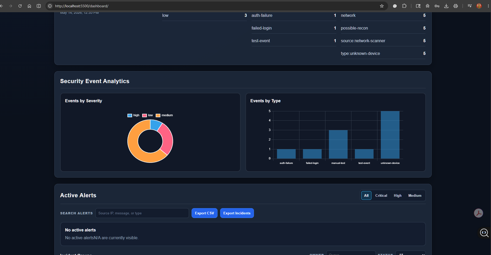
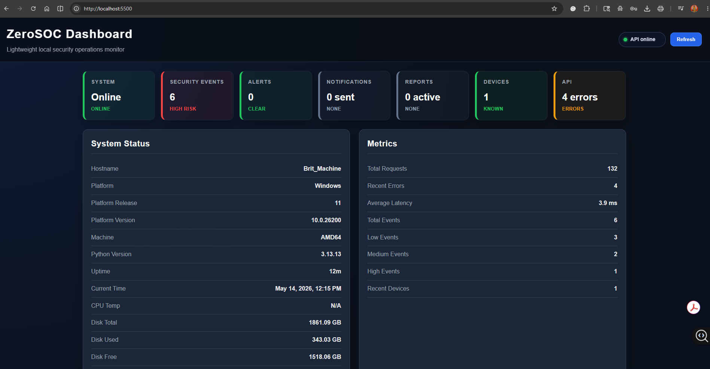
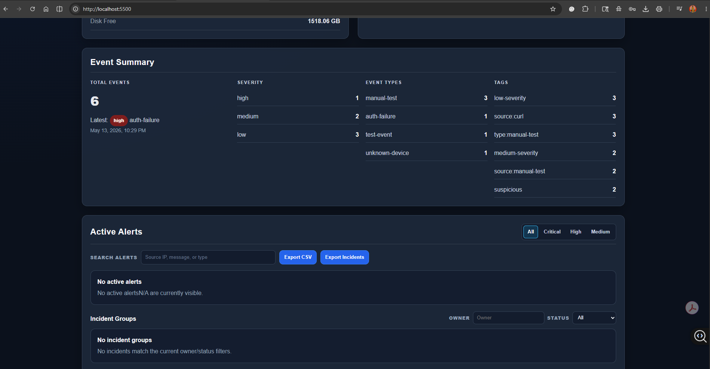
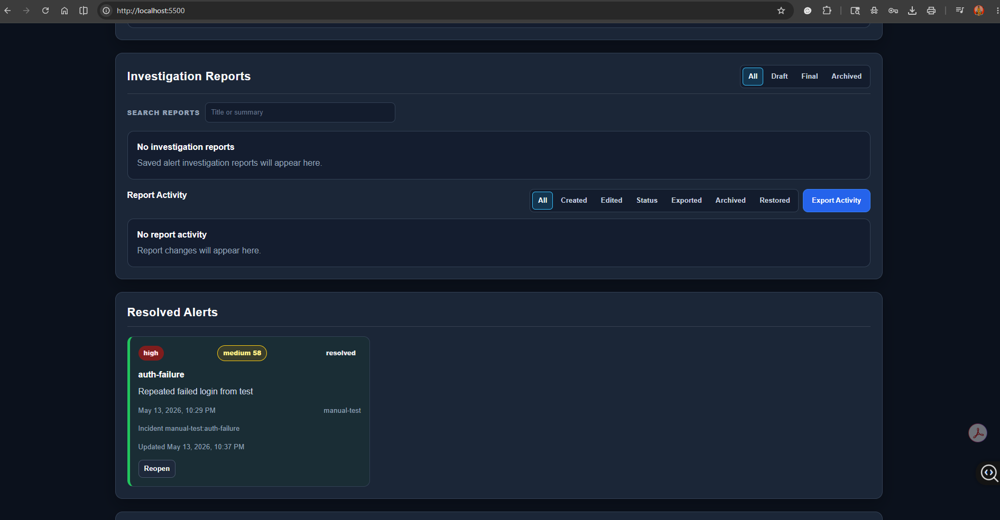

# ZeroSOC

ZeroSOC is a lightweight cybersecurity monitoring dashboard built with Python, SQLite, and a simple web frontend. It is designed as a small home-lab SOC-style project that can monitor local system health, track API activity, store security events, scan local network devices, group alerts into incidents, track investigation reports, and display key information in a browser dashboard.

The project is intended to run on lightweight hardware such as a Raspberry Pi Zero 2 W, while also being easy to develop and test on a Windows machine.

---

## Project Overview

ZeroSOC is being built as a cybersecurity and backend development portfolio project.

The goal is to demonstrate practical backend engineering, API design, local persistence, request logging, basic security controls, network visibility, alert workflows, incident tracking, and dashboard presentation in one compact project.

ZeroSOC currently includes:

- Python backend server
- Protected API endpoints
- API key authentication
- SQLite database storage
- Structured request logging
- Security event collection
- Event auto-tagging
- Event severity classification
- Event summary reporting
- Local network device scanning
- Unknown device detection
- Automatic alert creation from notable events
- Alert status workflow
- Incident grouping
- Investigation report tracking
- CSV export support
- Web dashboard using HTML, CSS, and JavaScript
- Dashboard summary cards
- System status panel
- Metrics panel
- Event summary dashboard section
- Security event analytics charts
- Searchable and filterable security events table
- Active alerts section
- Alert notifications section
- Investigation reports section
- Report activity tracking
- Resolved alerts section
- Network devices table

---

## Dashboard Preview

ZeroSOC includes a browser-based dashboard that displays backend API data in a visual SOC-style interface.



The dashboard includes summary cards, system status, API metrics, security event summaries, event analytics charts, alert panels, incident groups, investigation report tracking, resolved alerts, and network device visibility.

---

## Screenshots

### Dashboard Main View



The main dashboard view shows the ZeroSOC header, API status indicator, summary cards, system status, and backend metrics.

### Event Summary and Active Alerts



The event summary section displays total security events, severity breakdowns, event types, tags, and active alert controls.

### Security Event Analytics


The security event analytics section visualizes stored events by severity and event type using dashboard charts.

### Investigation Reports and Resolved Alerts



The reports and resolved alerts section shows investigation report controls, report activity tracking, and resolved alert history.

### API Health Response


The health endpoint confirms that the ZeroSOC backend is running and returning structured API responses.

### Events Summary API Response


The events summary API response shows aggregated security event data returned from the backend.

---

## Tech Stack

| Area | Technology |
|---|---|
| Backend | Python |
| Server | `http.server` / `BaseHTTPRequestHandler` |
| Database | SQLite |
| Frontend | HTML, CSS, JavaScript |
| Charts | Chart.js |
| Logging | JSON-style request logs |
| Security | API key authentication |
| Platform Target | Raspberry Pi Zero 2 W / Windows development machine |
| Version Control | Git and GitHub |

---

## Core Features

### System Health Monitoring

ZeroSOC exposes system status data through API endpoints. This includes basic service status, host information, uptime, platform details, Python version, disk usage, and current backend runtime information.

### API Key Authentication

Protected endpoints require an API key using the `X-API-Key` header.

Example:

```powershell
Invoke-RestMethod http://localhost:8000/api/v1/system -Headers @{"X-API-Key"="dev-zero-soc-key"}