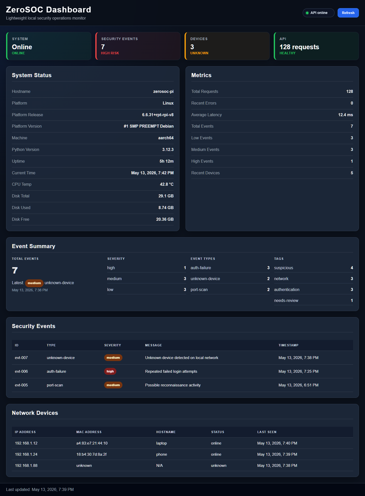

# ZeroSOC

ZeroSOC is a lightweight Raspberry Pi Zero 2 W-powered security operations dashboard for monitoring local system health, local network devices, API activity, and suspicious security events.

## Project Overview

ZeroSOC is being built as a cybersecurity/backend portfolio project. The goal is to create a small but practical security monitoring system that can run on lightweight hardware, expose clean backend API endpoints, track activity, and display security data in a web dashboard.

## Project Goals

- Monitor Raspberry Pi system health
- Scan local network devices
- Collect and store security events
- Expose protected backend API endpoints
- Track API requests and authentication attempts
- Display status and event data in a web dashboard
- Use SQLite for lightweight persistence
- Deploy as a small home-lab SOC-style tool

## Current Status

ZeroSOC currently has a working Python backend with structured API routing, SQLite persistence, API key authentication, request logging, local system status endpoints, security event storage, network device scanning, and basic metrics.

The backend cleanup pass is complete. Core GET and POST routes are wired consistently, and the dashboard now fetches live backend data for system status, metrics, recent security events, and network devices.

The dashboard polish pass is complete. The dashboard now displays event summary data from `/api/v1/events/summary`, formats timestamps for readability, shows a visible API status indicator, and includes a project screenshot below.

The active backend entry point is `run.py`. The `app/` package is currently reserved for future modularization work and should not be treated as the production server implementation yet.

## Dashboard Preview



## Quick Start

Run the backend:

```powershell
python run.py
```

Then open the dashboard in a browser:

```text
dashboard/index.html
```

Run the test suite:

```powershell
python -m unittest discover -s tests
```

Protected API endpoints use the development API key unless `ZEROSOC_API_KEY` is set:

```http
X-API-Key: dev-zero-soc-key
```

## Raspberry Pi Deployment

These steps target Raspberry Pi OS Lite on a Raspberry Pi Zero 2 W or similar small home-lab device.

### 1. Prepare the Pi

Update the OS and install Git:

```bash
sudo apt update
sudo apt upgrade -y
sudo apt install -y git
```

Python 3 is included with Raspberry Pi OS. ZeroSOC currently uses only the Python standard library, so no Python package install is required.

### 2. Clone the project

```bash
cd ~
git clone https://github.com/britbufkin1225-web/zerosoc.git
cd zerosoc
```

If you are using a private fork or a different remote, replace the repository URL with your own.

### 3. Set an API key

For local development, ZeroSOC falls back to `dev-zero-soc-key`. On a Pi, set your own key before starting the server:

```bash
export ZEROSOC_API_KEY="replace-with-a-long-local-key"
```

To make that key persistent for a shell session user, add the export line to `~/.bashrc`, then reload it:

```bash
source ~/.bashrc
```

### 4. Run the backend

```bash
python3 run.py
```

The backend listens on port `8000`:

```text
http://<pi-ip-address>:8000
```

Check the API from another machine on the same network:

```bash
curl http://<pi-ip-address>:8000/api/v1/health
curl -H "X-API-Key: replace-with-a-long-local-key" http://<pi-ip-address>:8000/api/v1/system
```

### 5. Open the dashboard

The dashboard is a static HTML page in `dashboard/index.html`.

For the simplest local demo, open the file directly on the machine where you are viewing it. If you want to view the dashboard from another computer, serve the dashboard directory from the Pi:

```bash
cd ~/zerosoc/dashboard
python3 -m http.server 8080
```

Then open:

```text
http://<pi-ip-address>:8080
```

The dashboard JavaScript currently points at `http://localhost:8000`. If you view the dashboard from another computer, update `API_BASE_URL` in `dashboard/app.js` to the Pi address, for example:

```javascript
const API_BASE_URL = "http://<pi-ip-address>:8000";
```

### 6. Optional systemd service

Create a service file so the backend can start on boot:

```bash
sudo nano /etc/systemd/system/zerosoc.service
```

Example service:

```ini
[Unit]
Description=ZeroSOC backend
After=network-online.target
Wants=network-online.target

[Service]
Type=simple
WorkingDirectory=/home/pi/zerosoc
Environment=ZEROSOC_API_KEY=replace-with-a-long-local-key
ExecStart=/usr/bin/python3 /home/pi/zerosoc/run.py
Restart=on-failure
RestartSec=5

[Install]
WantedBy=multi-user.target
```

If your Pi username is not `pi`, replace `/home/pi/zerosoc` with the correct project path.

Enable and start the service:

```bash
sudo systemctl daemon-reload
sudo systemctl enable zerosoc
sudo systemctl start zerosoc
sudo systemctl status zerosoc
```

View logs:

```bash
journalctl -u zerosoc -f
```

### 7. Update the deployment

Pull the latest code and restart the service:

```bash
cd ~/zerosoc
git pull
sudo systemctl restart zerosoc
```

## API Endpoints

| Method | Endpoint | Description | Auth Required | Status |
|---|---|---|---|---|
| GET | `/api/v1/health` | Basic backend health check | No | Working |
| GET | `/api/v1/status` | Service status and uptime | No | Working |
| GET | `/api/v1/system` | Host system information | Yes | Working |
| GET | `/api/v1/events` | List stored security events | Yes | Working |
| GET | `/api/v1/events/{id}` | Retrieve one security event by ID | Yes | Working |
| GET | `/api/v1/events/summary` | Security event summary counts | Yes | Working |
| GET | `/api/v1/alerts` | List active high-priority alerts | Yes | Working |
| POST | `/api/v1/events` | Create a new security event | Yes | Working |
| GET | `/api/v1/devices` | List recently seen network devices | Yes | Working |
| GET | `/api/v1/network/scan` | Scan local network devices | Yes | Working |
| GET | `/api/v1/logs/recent` | View recent request logs | Yes | Working |
| GET | `/api/v1/metrics` | View request, event, and device metrics | Yes | Working |

## API Authentication

Protected endpoints require an API key header:

```http
X-API-Key: dev-zero-soc-key
```

The default development key can be overridden with the `ZEROSOC_API_KEY` environment variable.

## Example API Tests

### Health check

```powershell
curl.exe http://localhost:8000/api/v1/health
```

### Service status

```powershell
curl.exe http://localhost:8000/api/v1/status
```

### System information

```powershell
curl.exe -H "X-API-Key: dev-zero-soc-key" http://localhost:8000/api/v1/system
```

### List security events

```powershell
curl.exe -H "X-API-Key: dev-zero-soc-key" http://localhost:8000/api/v1/events
```

### Create a security event

```powershell
$body = @{
  event_type = "manual-test"
  severity = "low"
  source = "curl"
  message = "Manual API test event"
} | ConvertTo-Json

curl.exe -X POST "http://localhost:8000/api/v1/events" `
  -H "X-API-Key: dev-zero-soc-key" `
  -H "Content-Type: application/json" `
  --data-binary $body
```

### View event summary

```powershell
curl.exe -H "X-API-Key: dev-zero-soc-key" http://localhost:8000/api/v1/events/summary
```

### View active alerts

```powershell
curl.exe -H "X-API-Key: dev-zero-soc-key" http://localhost:8000/api/v1/alerts
```

### View one event by ID

Replace `<event_id>` with a real event ID returned from `/api/v1/events`.

```powershell
curl.exe -H "X-API-Key: dev-zero-soc-key" http://localhost:8000/api/v1/events/<event_id>
```

### List network devices

```powershell
curl.exe -H "X-API-Key: dev-zero-soc-key" http://localhost:8000/api/v1/devices
```

### Run network scan

```powershell
curl.exe -H "X-API-Key: dev-zero-soc-key" http://localhost:8000/api/v1/network/scan
```

### View recent request logs

```powershell
curl.exe -H "X-API-Key: dev-zero-soc-key" http://localhost:8000/api/v1/logs/recent
```

### View metrics

```powershell
curl.exe -H "X-API-Key: dev-zero-soc-key" http://localhost:8000/api/v1/metrics
```

## Completed Milestone: Backend Cleanup Pass

- [x] Fixed `do_GET()` route flow
- [x] Added `GET /api/v1/events/{id}`
- [x] Added `GET /api/v1/devices`
- [x] Added `GET /api/v1/network/scan`
- [x] Added `GET /api/v1/metrics`
- [x] Added `do_POST()` for `POST /api/v1/events`
- [x] Connected POST event creation to SQLite
- [x] Fixed POST `request_id` response handling
- [x] Updated server runner to use `run_server()`
- [x] Verified core endpoints with PowerShell `curl.exe`

## Current Features

- Python HTTP backend
- Versioned API routes under `/api/v1`
- API key authentication for protected endpoints
- Consistent JSON API responses
- Request ID tracking
- Structured request logging
- SQLite database storage
- SQLite request log persistence
- Security event creation and retrieval
- Security event auto-tagging
- High-priority alert endpoint
- Event summary metrics
- Local system health/status endpoints
- Local network scanning
- Network device storage
- Unknown device detection
- Basic operational metrics endpoint

## Tech Stack

- Python
- SQLite
- Raspberry Pi OS Lite
- HTML/CSS/JavaScript dashboard
- GitHub for version control

## Planned Next Steps

- Add alert acknowledgement workflow
- Add dashboard alert panel

## Project Timeline

### Phase 1: Project Foundation

- [x] Create GitHub repository
- [x] Add initial project structure
- [x] Add Python backend entry point
- [x] Add basic health/status endpoints
- [x] Add versioned API routes

### Phase 2: Backend Core

- [x] Add system information endpoint
- [x] Add API key authentication
- [x] Add structured request logging
- [x] Add SQLite database storage
- [x] Add security event storage
- [x] Add security event filtering
- [x] Add event summary endpoint
- [x] Add POST event creation
- [x] Add single-event lookup by ID
- [x] Add metrics endpoint

### Phase 3: Network Monitoring

- [x] Add local network scanner
- [x] Add MAC address lookup from ARP table
- [x] Store scanned devices in SQLite
- [x] Detect unknown devices
- [x] Create security events for unknown devices
- [x] Add devices endpoint
- [x] Add network scan endpoint

### Phase 4: Dashboard

- [x] Create basic HTML dashboard
- [x] Add dashboard CSS styling
- [x] Fetch backend API data from JavaScript
- [x] Display system health
- [x] Display recent security events
- [x] Display network devices
- [x] Add manual refresh button
- [x] Display event summary

### Phase 5: Polish and Portfolio Readiness

- [x] Request logging
- [x] Request IDs
- [x] Recent logs helper
- [x] Metrics helper
- [x] Basic helper/database tests
- [x] Security event model
- [x] SQLite event storage
- [x] Event filtering
- [x] Event summary helper
- [x] Event-by-ID route
- [x] POST event route

### Phase 6: Local Network Monitoring

- [x] Network scanner helpers
- [x] ARP/MAC detection
- [x] Device storage
- [x] Unknown-device detection
- [x] `/api/v1/network/scan` route
- [x] `/api/v1/devices` route

### Phase 7: Database Storage

- [x] SQLite database
- [x] Security events table
- [x] Network devices table
- [x] Event persistence
- [x] Device persistence
- [x] Optional request log table

### Phase 8: Dashboard UI

- [x] Backend API support exists
- [x] Dashboard frontend
- [x] Summary cards
- [x] Event table
- [x] Device table
- [x] Dashboard screenshots

### Phase 9: Raspberry Pi Deployment

- [x] Add Raspberry Pi OS setup steps
- [x] Add backend run instructions
- [x] Add dashboard access notes
- [x] Add optional systemd service example
- [x] Add deployment update workflow

### Phase 10: Test Coverage

- [x] Add event summary helper coverage
- [x] Add network device processing coverage
- [x] Add request log metrics coverage

### Phase 11: Alerting

- [x] Add active alerts helper
- [x] Add `/api/v1/alerts` route
- [x] Add alert summary counts
- [x] Add alert helper tests

## Development Notes

ZeroSOC is currently in active development. The backend foundation is functional and tested, with protected API endpoints, request logging, SQLite persistence, security event storage, network device tracking, and basic metrics.

Phase 4 dashboard work now includes a polished visual layer. The dashboard loads in the browser, connects to the backend API, displays system health, metrics, event summaries, recent security events, and network devices, and includes a visible API status indicator.

The next major focus is alert acknowledgement workflow and dashboard alert display.
